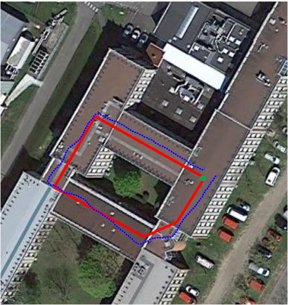
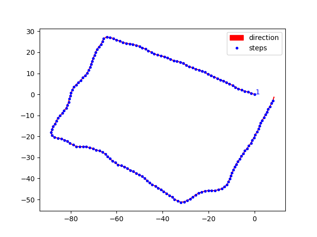
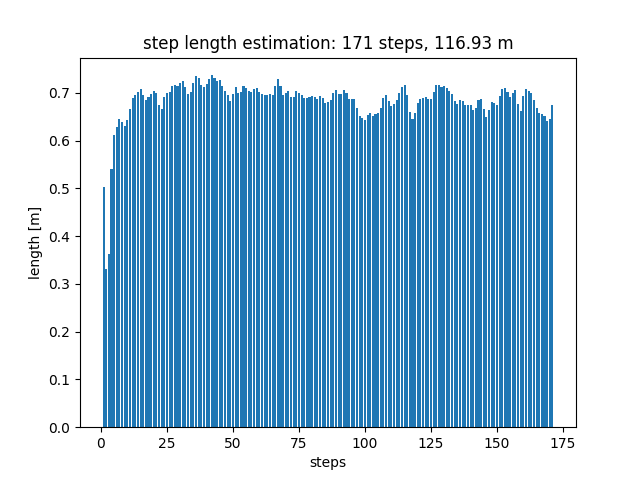

# Dead Reckoning
> pedestrian dead reckoning using phone sensors.

Indoor positioning method using *Pedestrian Dead Reckoning* ([PDR][wiki2]) based on phone sensors data: Accelerometer, Magnetometer and Gyroscope.

I implemented and used this localization technique for my internship at [Continental][continental]: **Implementation and optimization of a localization system for connected vehicles**, supervised by [CHEIKH Mohamed](mohamed.cheikh@continental-corporation.com)



_For more details about the PDR, please refer to this [Article][wiki].
_For more details about my internship, please email me at *aymane.lamhamdi@continental-corporation.com*


## Demos

In the following example, I made a complete turn in a hallway, i.e. a looped path of 116m and 168 steps.

- Tracking result using PDR:


- Length estimation per step:


## Installing the requirements
This project was developed in python.

To install all the packages used in this project:

```sh
pip install -r ./requirements.txt
```

## Uploading data sensors

Upload the csv files of your data sensors on ```./data/``` file:

- Accelerometer.csv
- Magnetometer.csv
- Gyroscope.csv
- Location.csv


## Usage

To display sensors data on graphs:

```sh
python ./src/plot.py
```

To display compute steps methods on graphs:
```sh
python ./src/computeSteps.py
```

To display length estimation per step:
```sh
python ./src/computeLength.py
```

To display tracking:
```sh
python ./src/deadreckoning.py
```


<!-- Markdown link & img dfn's -->
[npm-image]: https://img.shields.io/npm/v/datadog-metrics.svg?style=flat-square
[npm-url]: https://npmjs.org/package/datadog-metrics
[npm-downloads]: https://img.shields.io/npm/dm/datadog-metrics.svg?style=flat-square
[travis-image]: https://img.shields.io/travis/dbader/node-datadog-metrics/master.svg?style=flat-square
[travis-url]: https://travis-ci.org/dbader/node-datadog-metrics
[wiki]: https://www.researchgate.net/publication/
[continental]: https://www.continental.com/en/336369807_PEDESTRIAN_DEAD_RECKONING_USING_SMARTPHONES_SENSORS_AN_EFFICIENT_INDOOR_POSITIONING_SYSTEM_IN_COMPLEX_BUILDINGS_OF_SMART_CITIES
[wiki2]: https://en.wikipedia.org/wiki/Dead_reckoning
